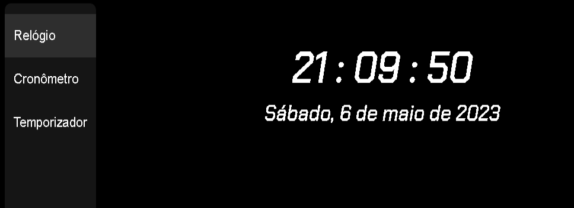
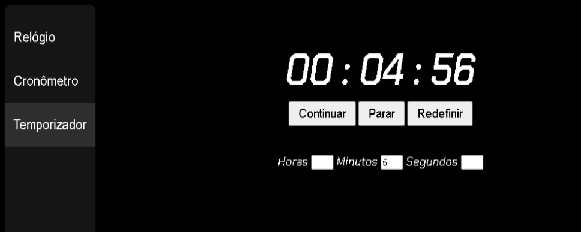

# Projeto_Relogio
 Projeto básico de um relógio digital online, esse relógio além de mostrar as horas mostra a data e também tem as funcionalidades de cronômetro e temporizador

### Tecnologias Utilizadas

- HTML
- CSS
- JavaScript

 

 *Página principal, mostra as horas e a data tendo como referência o calendario do seu computador ou celular.* 

 

*Essa página tem a funcionalidade de cronômetro, você pode pausar e continuar ou pode redefinir para zerar o cronômetro*

 

*Essa página tem a funcionalidade de um Timer, não foi pre-estabelecido um limite de tempo, então você pode colocar o tempo que desejar que o timer irá realizar uma contagem regressiva*

### Esse é um projeto básico, o foco foi a utilização do JavaScript Vanilla, nesse projeto eu pude desenvolver e aprimorar meus conhecimentos em funções, passagens por parâmetro, condições, interação do Html com JavaScript e também um aprofundamento do objeto Date, também foi utilizado CSS para estilização, contudo esse não foi o foco principal do projeto.  
### Também foi utilizado Web Design Responsivo, ou seja, é possivel renderizar esse projeto em uma variedade de dispositivos como celulares, tablets e computadores.

 

- Página Web : [RelógioDigital/BunhakGabriel](https://regal-peony-2bb6ff.netlify.app)
- Repositório GitHub : [Projeto_Relogio](https://github.com/bunhakgabriel/Projeto_Relogio)